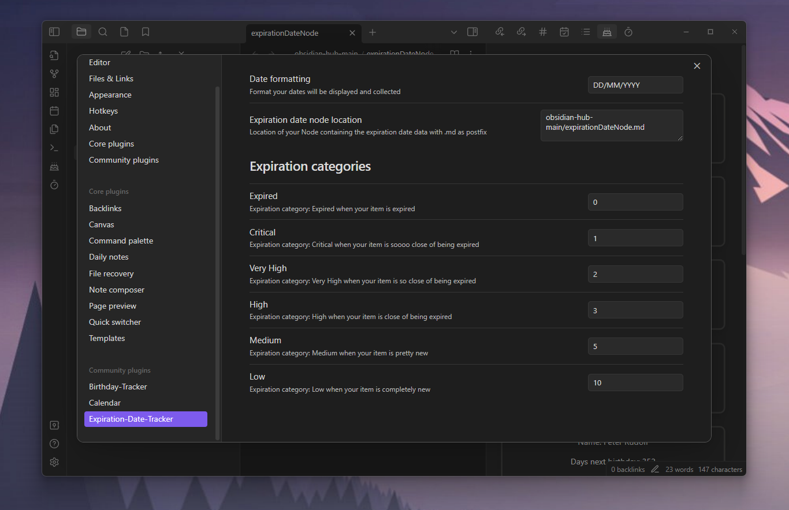

# Obsidian-Expiration-Date-Tracker-Plugin

With this plugin you can keep track of all the expiration dates of your items such as groceries.

## Using
You need a file containing all the expiration data. To find the file you need to add the location in the settings. After that you can add your items in a table:

| Name | Date | Number of Elements | 
| --- | --- | --- | 
| apple | 29/08/2023 | 3 | 
| banana | 22/12/2023 | 200g | 

After that you can click on the ribbon icon or use the ``Track Expiration Dates`` command to trigger the data collection. Then all items are displayed in a separate view. You also get a notice for all expired items.
The Expiration Category contains the category name, the items within this category and the expand button. This button will show/hide all your items within this category. The Item contains the name, the number of elements (which can be a number like 10 apples of a string like 200g banana) and the days till it expires.
## Commands 
You can search for a specific item or category or track all your expiration dates. The data you searched for will be displayed in a modal.

## Settings
You can set a date formatting. The default is: ``DD/MM/YYYY``. This is needed to collect your dates and display them. Also you can set the location of the file containing the expiration data. This must include `.md` as postfix. The default value is: `expirationDateNode.md`. \
You can also set all thresholds for the expiration categories. The default values are (in days):
- Expired: 0,
- Critical: 1,
- Very High: 2,
- High: 3,
- Medium: 5,
- Low: 10

For example if your item will expire in 6 days, it´s in the Low expiration category.

